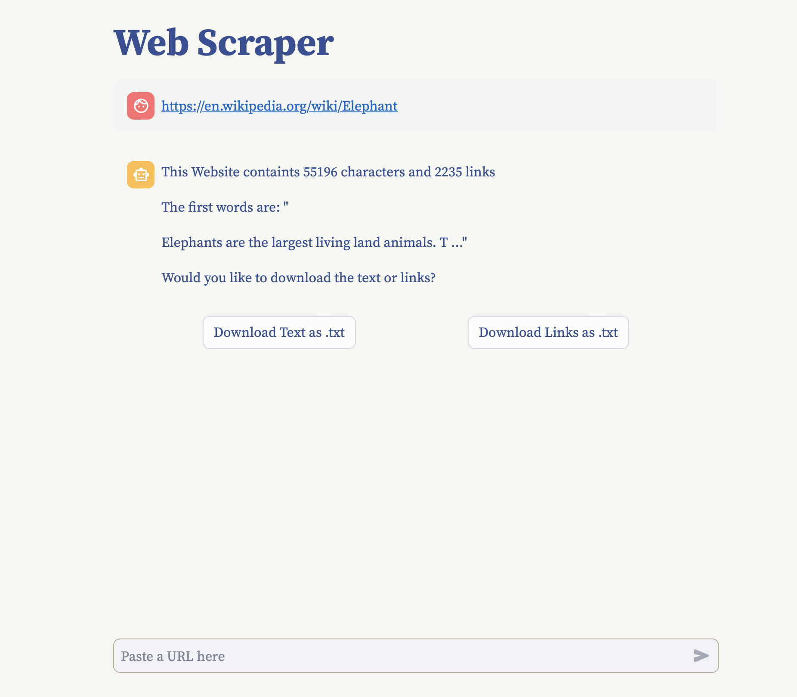

# Web Scraping
This code implements a web scraper for creating text files and a list of links. Altough this is a simpler implementation, similar approaches are used to train AI models utilizing internet data - especially machine learning models like OpenAI's ChatGPT. This implementation is written in [Pure Python](). Created for Learning Purposes.


&nbsp;

<div align="center"></div>

&nbsp;

## Dependencies

This code uses the following libraries:
- `streamlit`: for building the user interface.
- `numpy`: for creating arrays.
- `pandas`: for creating dataframes.
- `bs4`: for picking the text out of a webpage's HTML code, a process known as parsing.
- `requests`: for retreiving the HTML of a webpage.


&nbsp;

## Usage

Run the following commands in your terminal:
```
python3 -m venv my_env
source my_env/bin/activate # Mac OS or Linux
.\my_env\Scripts\activate # Windows
pip install --upgrade streamlit numpy pandas bs4 requests
streamlit run https://raw.githubusercontent.com/BrianLesko/text-similarity-search/main/app.py
```

This will start the Streamlit server, and you can access the chatbot by opening a web browser and navigating to `http://localhost:8501`.

&nbsp;

## How it Works

The web scraper works as follows:
1. The user enters a URL in the input field.
2. Requests retrieves the relevant HTML based on the user's URL.
3. bs4 parses the HTML code that makes up the website into text and links.
4. The chatbot displays some information about the text it parsed.
5. The option to download the text or links appears.

&nbsp;

## Repository Structure
```
doc-chat/
├── .streamlit/
│   └── config.toml # theme info for the UI
├── docs/
│   └── preview.png
├── app.py # the code and UI integrated together live here
├── customize_gui # for adding gui elements like the about sidebar
├── requirements.txt # the python packages needed to run locally
└── .gitignore # includes the local virtual environment named my_env
```

&nbsp;

## Topics 
```
Python | Streamlit | Git | Low Code UI
Chat interface | Web scraping | HTML Parsing
Self taught coding | Mechanical engineer | Robotics engineer
```
&nbsp;

<hr>

&nbsp;

<div align="center">


╭━━╮╭━━━┳━━┳━━━┳━╮╱╭╮        ╭╮╱╱╭━━━┳━━━┳╮╭━┳━━━╮
┃╭╮┃┃╭━╮┣┫┣┫╭━╮┃┃╰╮┃┃        ┃┃╱╱┃╭━━┫╭━╮┃┃┃╭┫╭━╮┃
┃╰╯╰┫╰━╯┃┃┃┃┃╱┃┃╭╮╰╯┃        ┃┃╱╱┃╰━━┫╰━━┫╰╯╯┃┃╱┃┃
┃╭━╮┃╭╮╭╯┃┃┃╰━╯┃┃╰╮┃┃        ┃┃╱╭┫╭━━┻━━╮┃╭╮┃┃┃╱┃┃
┃╰━╯┃┃┃╰┳┫┣┫╭━╮┃┃╱┃┃┃        ┃╰━╯┃╰━━┫╰━╯┃┃┃╰┫╰━╯┃
╰━━━┻╯╰━┻━━┻╯╱╰┻╯╱╰━╯        ╰━━━┻━━━┻━━━┻╯╰━┻━━━╯
  


&nbsp;


<a href="https://twitter.com/BrianJosephLeko"></a> &nbsp; &nbsp; &nbsp; &nbsp; &nbsp; &nbsp; <a href="https://github.com/BrianLesko"></a> &nbsp; &nbsp; &nbsp; &nbsp; &nbsp; &nbsp; <a href="https://www.linkedin.com/in/brianlesko/"></a>

follow all of these or i will kick you

</div>


&nbsp;


